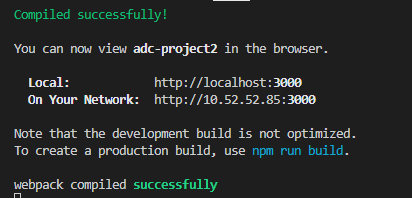

# adc-project2/webClent

## Getting started

>$ npm run start  

### 執行成功畫面

## Installation

>$ npm install

## Description

此專案是中央電腦攻擊防禦課程Project 2 作業，
主要內容為 資訊隱藏 的 圖片上傳，內嵌文字、解析圖片中的文字。

此份code是網頁前端框架 ReactJs 撰寫，
執行方式如同上述 Getting started下達指令即可執行，
node 已有套件管理的 package.json，因此只須下達 npm install 即可將所需套件安裝完成。

## Package

### Router

* react-router-dom

### React Template

#### main use: material-ui

https://mui.com/material-ui/getting-started/templates/

#### Other

* [Ant Design of React](https://ant.design/docs/react/introduce)
* [material-ui](https://mui.com/material-ui/getting-started/installation/)
* [react-boostrap](https://react-bootstrap.github.io/getting-started/introduction)

## Architecture

### 1. Floder

#### 1.1. node_modules: node packge 存放位置

#### 1.2. public: 存放靜態檔案位置

#### 1.3. src

##### > 1.3.1. Floder

* **component** : 通用 view 組件，主要是些微修正原 tmplate 的 component 的功能，讓騎士適用於此專案。
* **Model**: 與　API　請求與發送位置
* **View**: 主要呈現畫面的檔案資料
* **ViewMode**l: 處理資料，前端資料修正調整，請求API所得的資料調整至能讓 View 使用

##### > 1.3.2. File

* **App.*** : URL 路由 管理，引入 View 的位置
* **index.***: 程式最一開始的進入點

#### 1.4. Z_Readme: ReadMe

### 2. File

* package.json: Package 管理檔
